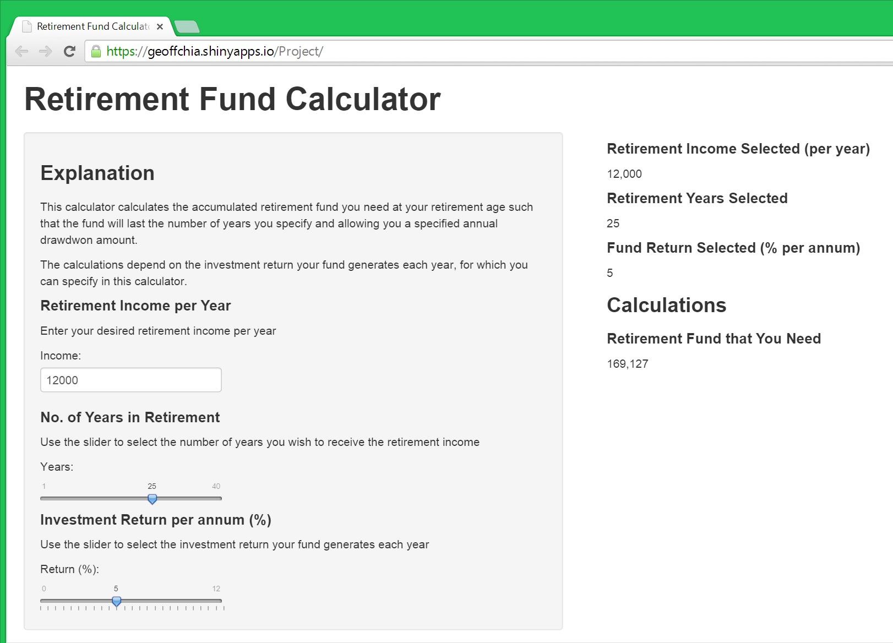

## Background

* You worked hard all your life and you are about to retire and enjoy life
* But have you got enough nest egg to last your retirement years?
* A question that is not easily answered if you do not have the right financial knowledge
* Luckily in the current internet era, the answer is right at your fingertips


--- .class #id 

## Introducing Retirement Fund Calculator

* You can assess the Retirement Fund Calculator [here](https://geoffchia.shinyapps.io/Project/)
* The following is a screenshot of the Retirement Fund Calculator



--- .class #id 
## Input Variables and Formula

* There are 3 input variables
    - Yearly income you require (default: $12,000)
    - Number of years to receive the income (default: 25 years)
    - Investment return (% per year) of your fund (default: 5%)
* With the default input variables, the retirement fund required is $169,127
* The calculations are carried out using the following well known financial formula:

$Fund = Income * \frac{1 - v^n}{rate}$

  where:  
  n = number of years  
  rate = investment return  
  $v = \frac{1}{1 + rate}$

--- .class #id 

## Checking the Calculations using R

* Using the default input variables, R produces the following answer which is the same as the default answer by the shiny app

```r
income <- 12000  
rate <- .05  
n <- 25  
v <- 1 / (1 + rate)  
fund <- income * (1 - v ^ n) / rate
print(fund)
```

```
## [1] 169127
```


